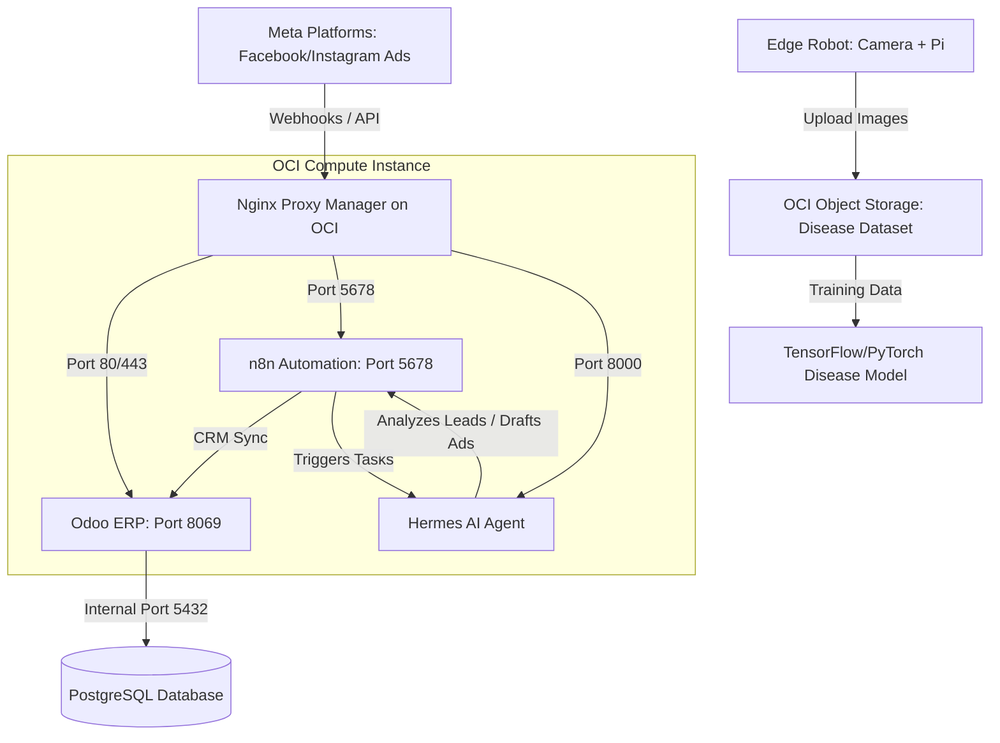

# KebunData AI, ERP & Cloud Architecture Blueprint

This blueprint outlines the recommended architecture to build and scale your system on **Oracle Cloud Infrastructure (OCI)** and **GitHub**, combining Odoo ERP, AI-driven marketing automation, and edge robotics for plant disease image collection.

---

## 1. High-Level Architecture Diagram

---

## 2. Component Breakdown

### 🤖 Component A: AI Marketing & Sales Team (The "Brain")
* **Stack:** `n8n` (Workflow Automation) + `CrewAI` / `Hermes Agent` (Multi-Agent Team).
* **Workflow:**
  1. A user interacts with your Meta Ads or sends a message.
  2. **n8n** captures the webhook event.
  3. **Hermes / CrewAI** evaluates the lead's intent, drafts personalized copy, or auto-responds to guide them toward closing.
  4. Once qualified, **n8n** automatically pushes the contact into Odoo's CRM module.

### 💼 Component B: ERP Backend (The "Nervous System")
* **Stack:** `Odoo 18.0` (Community) + `PostgreSQL 15` in Docker.
* **Role:** Handles CRM (Leads/Sales), Inventory, Accounting, and leaves management. 
* **Custom Module:** Your `kebundata_gantt_view` module will reside inside Odoo to help visualize planning/leaves.

### 🚜 Component C: Edge Robotics & CV Library (The "Eyes")
* **Stack:** Raspberry Pi/Jetson Nano + Camera + `OCI Python SDK` + `OCI Object Storage`.
* **Workflow:**
  1. The robot navigates the plants and snaps pictures of leaves.
  2. The onboard Python script tags the image with metadata (Date, Plant ID, GPS) and uploads it directly to an **OCI Object Storage Bucket** using the OCI SDK.
  3. This bucket acts as your raw dataset library for training an AI model to detect diseases later.

---

## 3. Recommended Repository Structure

Since these three components use completely different technology stacks, keeping them in a **Multi-Repository** structure is highly recommended to prevent code conflicts and keep deployments clean.

| Repository Name | Purpose | Technology |
| :--- | :--- | :--- |
| **`kebundata-erp`** *(Current)* | Odoo Docker config & custom modules (`kebundata_gantt_view`) | Python, Odoo XML, Docker |
| **`kebundata-marketing-agents`** | CrewAI configs, prompt files, and n8n workflow backups | Python, n8n JSON configs |
| **`kebundata-robotics-vision`** | Robot camera control script, dataset tools, and ML training code | Python, OpenCV, PyTorch/TensorFlow |

---

## 4. Implementation Roadmap

### Phase 1: ERP Foundation (Current Step)
* Finalize the Odoo Docker workspace sync so you can customize Odoo and push code safely to GitHub/OCI.
* Configure Odoo to load your custom Gantt view module.

### Phase 2: AI Marketing & Automation integration
* Configure **Nginx Proxy Manager** on your OCI VM to expose Odoo, n8n, and your agents securely under your subdomains (e.g. `erp.kebundata.my`, `n8n.kebundata.my`).
* Build n8n workflows to capture Meta leads and write them to Odoo.

### Phase 3: Robotics Dataset Collection
* Set up a private OCI Object Storage bucket.
* Write the camera capture script to automatically upload images to this bucket.
